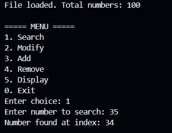
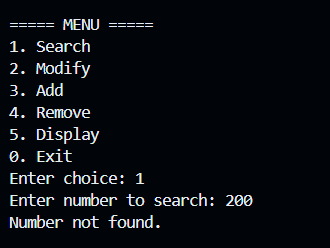
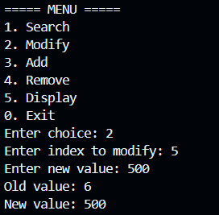
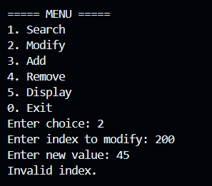
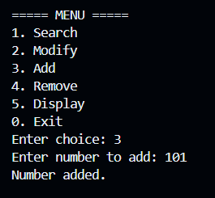
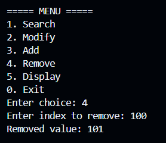
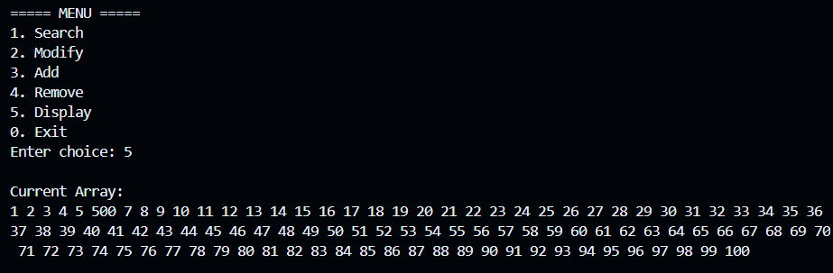

# Assignment 1 – CS-303

Syed Abdul Mateen Shah  
Java  

Program Description

This program reads integers from input.txt into a standard Java array 
(ArrayList is not used).

The program allows the user to:
- Search for a number and give its index
- Modify a value at a given index
- Add a number to the end of the array
- Remove a number at a given index
- Display the array

Try-catch blocks are used for the modify and add functions as required.

How to Run

Compile:
javac Main.java

Run:
java Main

Screenshots:

Search – Found  

Search – Not Found  

Modify – Valid Index  

Modify – Invalid Index (Exception Handling)  

Add Function  

Remove Function  

Display Function  

Challenges Faced

There werent many challenges I faced in this assignment, only challenge was making sure the remove function correctly shifts elements without
  losing data or causing index errors. Another challenge was bugs but co-pilot helped me in those.
